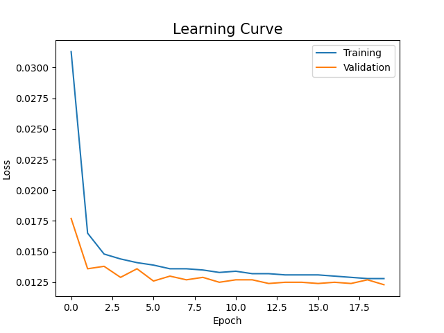

# Behavioral Cloning: End to end learning in a Self Driving Car Simulator

## Introduction
This repository contains an implementation of NVIDIA's End-to-End Learning paper for self-driving cars, which uses a convolutional neural network (CNN) to map raw pixels from a single front-facing camera to steering commands. The model architecture and taining details are found in the [paper](https://images.nvidia.com/content/tegra/automotive/images/2016/solutions/pdf/end-to-end-dl-using-px.pdf).

## Dataset
The datset is collected from [Udacity's Self Driving Car Simulator](https://github.com/udacity/self-driving-car-sim).

## Model Training
The learning curve below shows the training progress.

